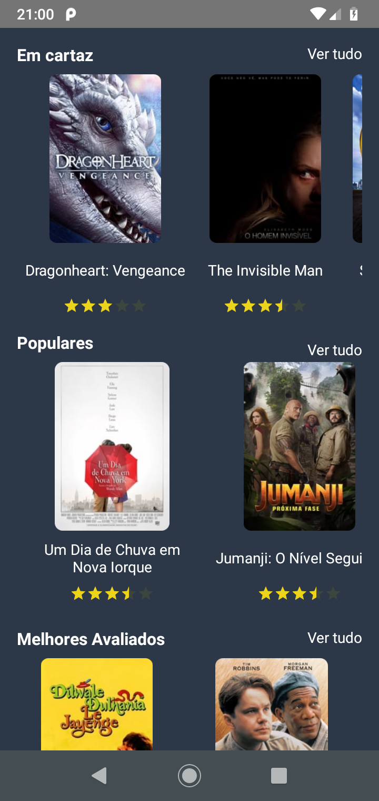

# TheMovieDB
Aplicativo Android feito com Android Studio, Kotlin e arquitetura MVVM.

# Descrição
O aplicativo é responsável por exibir as informações da API MovieDB e organizá-las entre:

- Em cartaz
- Populares
- Melhores Avaliados
- Em breve

Além disso permite a seleção de um filme da lista para a exibição de maiores detalhes em uma activity separada.
O aplicativo foi construído visando demonstrar como funciona o mapeamento da API e a utilização da arquitetura MVVM juntamente com Rx. Detalhes de Layout, margens e cores foram revisados, mas focados em segundo plano. Alguns cliques em botões não foram implementados, pois seriam só repetição de trabalho e criação de views similares, o que não é o objetivo do desenvolvimento do aplicativo.

# Bibliotecas utilizadas
- Koin
- Retrofit
- RX (RxJava, RxKotlin, RxAndroid)
- Glide
- ColorRatingBar
- SmoothProgressBar

## Instalação
Para executar o aplicativo basta abrir o projeto no Android Studio e clicar em 'Run' ou instalar diretamente no aparelho o APK disponível na pasta app/release.

## ScreenShots
MainActivity| DetailActivity
:-- | :--
 | 
 | 